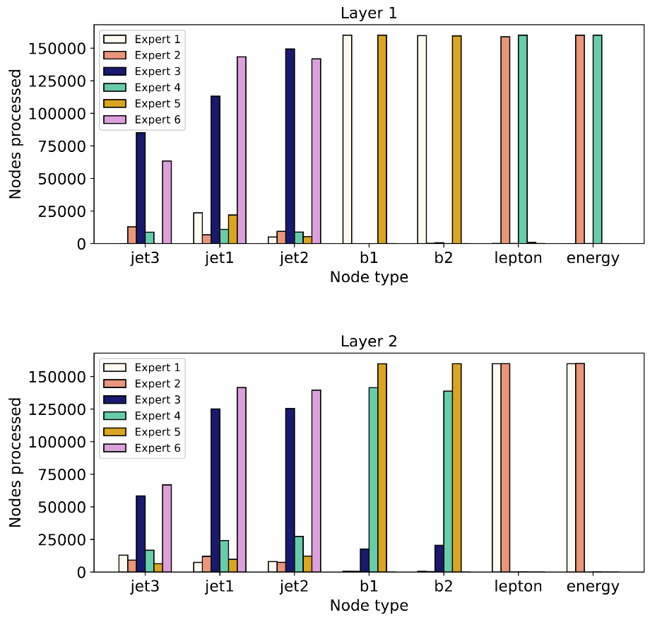
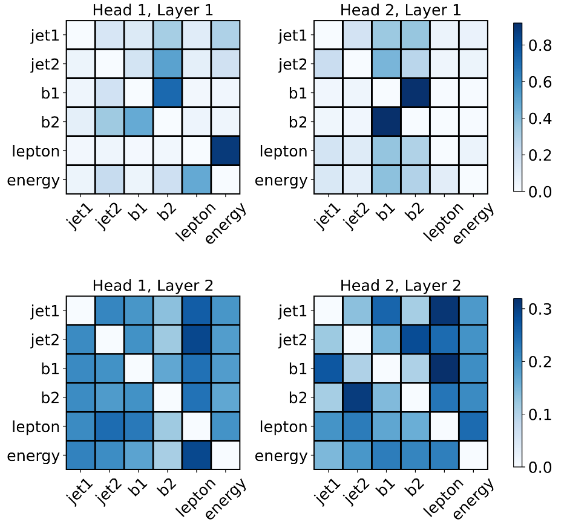

# Mixture of Experts Graph Transformer
Pytorch implementation for the paper [Mixture-of-Experts Graph Transformers for Interpretable Particle Collision Detection](https://arxiv.org/abs/2501.03432). 

```
Transformer(
  (embed): EmbedEncode(
    (embedding): Linear(in_features=12, out_features=80, bias=True)
    (encoding): Linear(in_features=4, out_features=80, bias=True)
  )
  (encoders): ModuleList(
    (0-1): 2 x Encoder(
      (attend): MHGAttend(
        (wq): Linear(in_features=80, out_features=80, bias=True)
        (wk): Linear(in_features=80, out_features=80, bias=True)
        (wv): Linear(in_features=80, out_features=80, bias=True)
        (wo): Linear(in_features=80, out_features=80, bias=True)
      )
      (moveforward): MoeveForward(
        (expert): Sequential(
          (0): Linear(in_features=80, out_features=20, bias=True)
          (1): LeakyReLU(negative_slope=0.01)
          (2): Linear(in_features=20, out_features=80, bias=True)
          (3): Dropout(p=0.0, inplace=False)
        )
        (experts): ModuleList(
          (0-5): 6 x Sequential(
            (0): Linear(in_features=80, out_features=20, bias=True)
            (1): LeakyReLU(negative_slope=0.01)
            (2): Linear(in_features=20, out_features=80, bias=True)
            (3): Dropout(p=0.0, inplace=False)
          )
        )
        (noise_network): Linear(in_features=80, out_features=6, bias=False)
        (router_network): Linear(in_features=80, out_features=6, bias=False)
        (softplus): Softplus(beta=1.0, threshold=20.0)
      )
      (normalize1): LayerNorm((80,), eps=1e-05, elementwise_affine=True)
      (normalize2): LayerNorm((80,), eps=1e-05, elementwise_affine=True)
      (drop): Dropout(p=0.0, inplace=False)
    )
  )
  (cut): Linear(in_features=80, out_features=40, bias=True)
  (relu): ReLU()
  (predict): Linear(in_features=40, out_features=2, bias=True)
)
```


## TL;DR
The MoE Graph Transformer achieves competitive accuracy in classifying rare particle collisions while embedding interpretability through attention maps and expert specialization, offering a transparent tool for high-energy physics analysis.

## Data 
The dataset used to train the model is available at [this link](https://github.com/alessiodevoto/sparticles)

## Metrics 
We train and evaluate the model and compare it with other architectures (Multilayer perception, Graph Convolutional Neural network, Graph Transformer). The results are shown in the table \


## Explainability visualization



## Code

## Cite 
Please cite our work if you found it useful
@article{genovese2025mixtureofexpertsgraphtransformersinterpretable,
  title     = {Mixture-of-Experts Graph Transformers for Interpretable Particle Collision Detection},
  author    = {Donatella Genovese and Alessandro Sgroi and Alessio Devoto and Samuel Valentine and Lennox Wood and Cristiano Sebastiani and Stefano Giagu and Monica D'Onofrio and Simone Scardapane},
  journal   = {Scientific Reports},
  year      = {2025},
  volume    = {15},
  number    = {},
  pages     = {12003},
  doi       = {10.1038/s41598-025-12003-9},
  url       = {https://www.nature.com/articles/s41598-025-12003-9}
}
