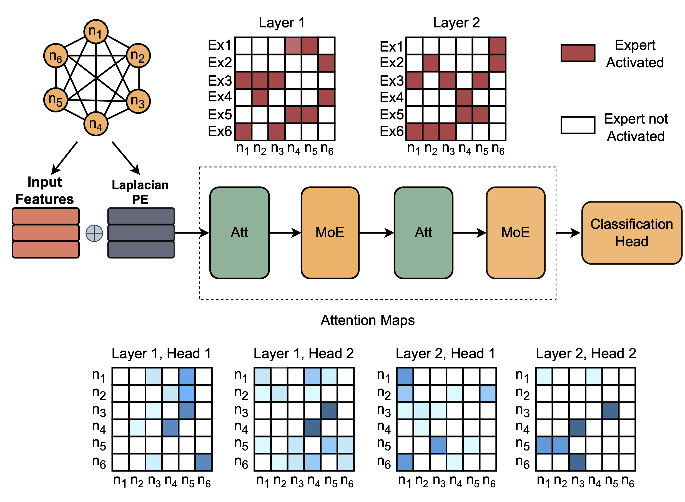

# Mixture of Experts Graph Transformer
Pytorch implementation for the paper [Mixture-of-Experts Graph Transformers for Interpretable Particle Collision Detection](https://arxiv.org/abs/2501.03432). 

## TL;DR
The MoE Graph Transformer achieves competitive accuracy in classifying rare particle collisions while embedding interpretability through attention maps and expert specialization, offering a transparent tool for high-energy physics analysis.

## Data 
The dataset used to train the model is available at [this link](https://github.com/alessiodevoto/sparticles)

## Metrics 
We train and evaluate the model and compare it with other architectures (Multilayer perception, Graph Convolutional Neural network, Graph Transformer). The results are shown in the table

## Data preparation
TODO
## Training and evalutation
TODO
## Explainability visualization

## Cite 
Please cite our work if you found it useful
@article{genovese2025mixtureofexpertsgraphtransformersinterpretable,
      title={Mixture-of-Experts Graph Transformers for Interpretable Particle Collision Detection}, 
      author={Donatella Genovese and Alessandro Sgroi and Alessio Devoto and Samuel Valentine and Lennox Wood and Cristiano Sebastiani and Stefano Giagu and Monica D'Onofrio and Simone Scardapane},
      year={2025},
      url={https://arxiv.org/abs/2501.03432}, 
}
